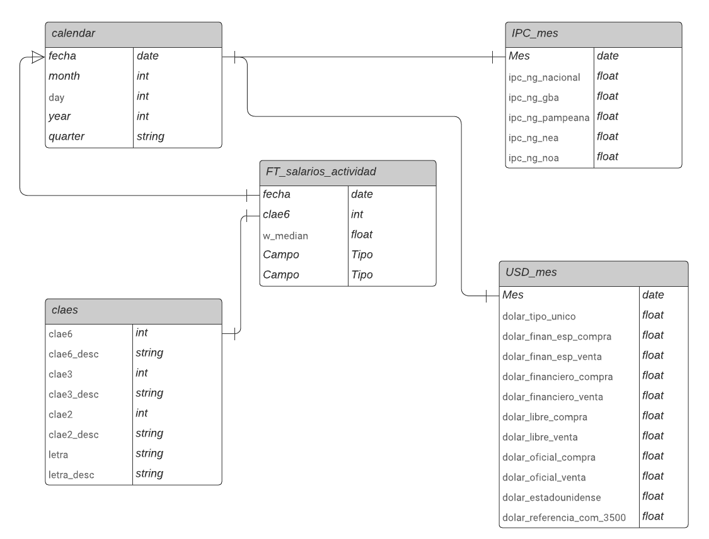

### Ejercicio 1: Elección de dataset y preguntas

Para la realización seleccioné los dataset de https://datos.gob.ar/dataset/ sobre la evolución salarial por industria en la Republica Argentina.

Para esto utilizaré los siguientes datasets:
1. Salarios promedio y mediano, por sector de actividad :money_with_wings:
2. IPC base 2016
3. Tipo de cambio diario $ a USD :dollar:
4. Nomenclador actividad AFIP

### Framing Problems

- Hay diferencia en la tendencia temporal entre los salarios reales en pesos y en USD? :chart_with_upwards_trend:
- Cual es el spread histórico entre la inflación y los aumentos del salario promedio?
- Que actividades económicas registran el mayor salario real en el ultimo año?
- Cual es la actividad económica con mayor crecimiento de salarios promedio en terminos reales?