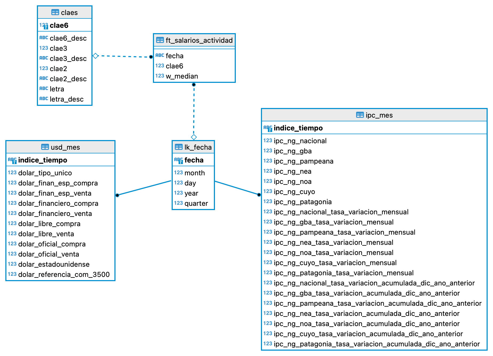

# Trabajo Práctico Final Foundations
### ITBA - Cloud Data Engineering

Bienvenido al TP Final de la sección Foundations del Módulo 1 de la Diplomatura en Cloud Data Engineering del ITBA.

En este trabajo práctico vas a poner en práctica los conocimientos adquiridos en: 

1. Bases de Datos Relacionales (PostgreSQL específicamente).
2. BASH y Linux Commandline.
3. Python 3.7+.
4. Docker.

Para realizar este TP vamos a utlizar la plataforma Github Classrooms donde cada alumno tendrá acceso a un repositorio de Git privado hosteado en la plataforma Github.

En cada repositorio, en la sección de [Issues](https://guides.github.com/features/issues/) (tab a la derecha de Code en las tabs de navegación en la parte superior de la pantalla) podrás ver que hay creado un issue por cada ejercicio. 
El objetivo es resolver ejercicio/issue creando un branch y un pull request asociado. 

Debido a que cada ejercico utiliza el avance realizado en el issue anterior, cada nuevo branch debe partir del branch del ejercicio anterior.

Para poder realizar llevar a cabo esto puede realizarlo desde la web de Github pero recomendamos hacerlo con la aplicación de línea de comando de git o con la aplicación de [Github Desktop](https://desktop.github.com/) (interfaz visual) o [Github CLI](https://cli.github.com/) (interfaz de línea de comando).

La idea de utilizar Github es replicar el ambiente de un proyecto real donde las tareas se deberían definir como issues y cada nuevo feature se debería crear con un Pull Request correspondiente que lo resuelve. 
https://guides.github.com/introduction/flow/
https://docs.github.com/en/github/getting-started-with-github/quickstart/github-flow

**MUY IMPORTANTE: parte importante del Trabajo Práctico es aprender a buscar en Google para poder resolver de manera exitosa el trabajo práctico**

## Ejercicios

### Ejercicio 1: Elección de dataset y preguntas

Elegir un dataset de la [wiki de PostgreSQL ](https://wiki.postgresql.org/wiki/Sample_Databases) u otra fuente que sea de interés para el alumno.

Crear un Pull Request con un archivo en [formato markdown](https://guides.github.com/features/mastering-markdown/) expliando el dataset elegido y  una breve descripción de al menos 4 preguntas de negocio que se podrían responder teniendo esos datos en una base de datos relacional de manera que sean consultables con lenguaje SQL.

Otras fuentes de datos abiertos sugeridas:
https://catalog.data.gov/dataset
https://datasetsearch.research.google.com/
https://www.kaggle.com/datasets

## Ejercicio 2: Crear container de la DB

Crear un archivo de [docker-compose](https://docs.docker.com/compose/gettingstarted/) que cree un container de [Docker](https://docs.docker.com/get-started/) con una base de datos PostgreSQL con la versión 12.7.
Recomendamos usar la [imagen oficial de PostgreSQL](https://hub.docker.com/_/postgres) disponible en Docker Hub.
 
Se debe exponer el puerto estándar de esa base de datos para que pueda recibir conexiones desde la máquina donde se levante el container.

## Ejercicio 3: Script para creación de tablas

Crear un script de bash que ejecute uno o varios scripts SQL que creen las tablas de la base de datos en la base PostgreSQL creada en el container del ejercicio anterior.

Se deben solamente crear las tablas, primary keys, foreign keys y otras operaciones de [DDL](https://en.wikipedia.org/wiki/Data_definition_language) sin crear o insertar los datos. 

## Ejercicio 4: Popular la base de datos

Crear un script de Python que una vez que el container se encuentre funcionando y se hayan ejecutado todas las operaciones de DDL necesarias, popule la base de datos con el dataset elegido.

La base de datos debe quedar lista para recibir consultas. Durante la carga de información puede momentareamente remover cualquier constraint que no le permita insertar la información pero luego debe volverla a crear.

Este script debe ejecutarse dentro de un nuevo container de Docker mediante el comando `docker run`.

El container de Docker generado para no debe contener los datos crudos que se utilizarían para cargar la base.
Para pasar los archivos con los datos, se puede montar un volumen (argumento `-v` de `docker run`) o bien bajarlos directamente desde Internet usando alguna librería de Python (como `requests`).

## Ejercicio 5: Consultas a la base de datos

Escribir un script de Python que realice al menos 5 consultas SQL que puedan agregar valor al negocio y muestre por pantalla un reporte con los resultados.

Este script de reporting debe correrse mediante una imagen de Docker con `docker run` del mismo modo que el script del ejercicio 4.

## Ejercicio 6: Documentación y ejecución end2end

Agregue una sección al README.md comentando como resolvió los ejercicios, linkeando al archivo con la descripción del dataset y explicando como ejecutar un script de BASH para ejecutar todo el proceso end2end desde la creación del container, operaciones de DDL, carga de datos y consultas. Para esto crear el archivo de BASH correspondiente. 

## RESOLUCION

Los datos utilizados corresponden al servicio de [Datos Argentina](https://catalog.data.gov/dataset), que brinda una serie de datasets públicos.

1. Como primer paso creo un container que levanta Postgres 12.7
2. Luego genero las tablas de acuerdo al dataset definido, generando el siguiente schema

3. Mediante un script de Python me conecto directamente al servicio de datos públicos citado anteriormente y obtengo los datasest que populan las tablas generadas en el paso anterior.

4. Genero una serie de consultas SQL y con la librerias Bokeh y Plotly grafico plots para responder las consultas de negocio. Esto esta incluido en el container y al ejecutarlo permite acceder a la notebook con los resultados.
En este punto tuve algunas dificultades, porque mi primer idea era que ejecute un servidor [Panel](https://panel.holoviz.org/), si bien el docker ejecutaba correctamente, pero tuve inconvenientes para acceder a la aplicacion servida. Por lo tanto como alternativa se visualizan el output en una notebook de jupyter.

## Pasos para ejecutar el proceso

1. Descargar el contenido del repo
2. Posicionados sobre la carpeta buildeamos la solución
    - docker-compose build
3. Desplegamos la solución
    - docker-compose up
4. Finalizada la ejecución sin errores, podremos acceder al jupyter notebook
    - [link](http://127.0.0.1:8888/notebooks/notebook.ipynb)

## Orquestacion

`docker-compose.yml` contiene todas las instrucciones del proceso de ejecución.

1. db: levantamos la imagen de postgres y creamos las tablas
2. insert_data: populamos las tablas
3. analisis: generamos las queries de consulta de las tablas generadas y disponibilizamos una jupyter notebook para visualizar los gráficos de análisis

### Consideraciones

- Generé dependencias entre los procesos con el término `DEPENDS_ON`para evitar que se solapen y se ejecuten en cascada.
- Al insertar los datos copio el SQL en la carpeta `docker-entrypoint-initdb` ya que de otra manera no encontraba el archivo y no generaba las tablas

### Notas

- Perdón la demora pero comencé la práctica dias despues y la verdad me resultó desafiante, mas que nada la parte de Docker en la cual tengo poca experiencia y requirió mucho tiempo de investigación. Es mas estoy seguro de que tengo muchos puntos por mejorar en el TP.
- Obviamente se podria plantear mejoras en la solución, como hacer controles de carga, no definir el logueo en el script, reducir harcodeos y algunos otros puntos mas que mi conocimiento no me permite detectar.

